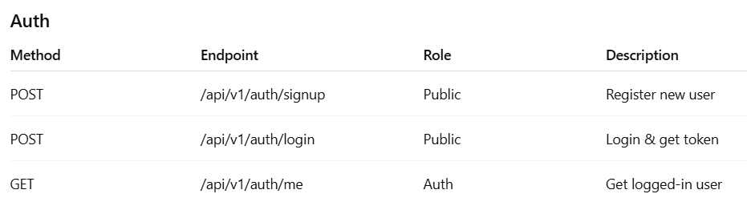
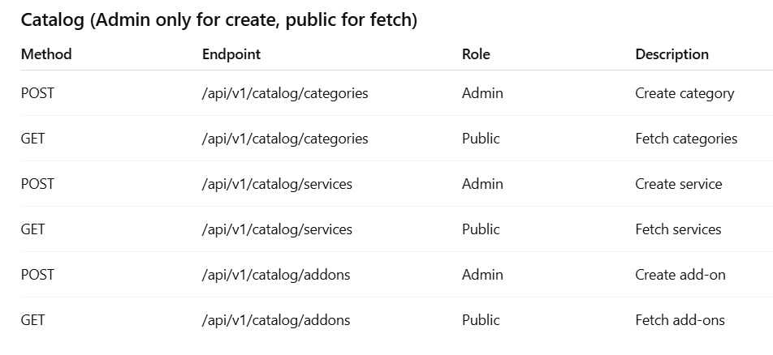
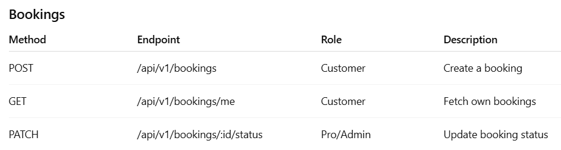
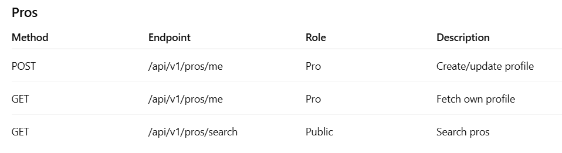

# 🛠️ Service Booking API

A role-based backend API for a **service booking platform**, built with **Node.js**, **Express.js**, and **MongoDB Atlas**.  
It supports authentication, professional profiles, catalog management, and a booking flow between customers and pros.

---

## 🚀 Features

- **Authentication & Authorization**

  - JWT-based auth (login, signup, logout).
  - Role-based access control: `admin`, `pro`, `customer`.

- **Catalog Management (Admin only)**

  - Create & fetch categories.
  - Create & fetch services under categories.
  - Create & fetch add-ons for services.

- **Professional Profiles (Pro role)**

  - Create/update personal profile.
  - Define services offered, pincodes covered, and availability slots.
  - Public search API for customers to find pros.

- **Booking Management**

  - Customers can book services with pros.
  - Customers can fetch their own bookings.
  - Pros/Admins can update booking statuses.

- **Idempotency Support**

  - Prevents duplicate bookings via `Idempotency-Key` headers.

- **Secure**
  - JWT auth middleware.
  - Role-based permission middleware.
  - Input validation middleware.

---

## 🏗️ Tech Stack

- **Backend**: Node.js, Express.js
- **Database**: MongoDB Atlas (Mongoose ODM)
- **Auth**: JWT (JSON Web Tokens)
- **Testing**: Jest + Supertest
- **Other**:
  - dotenv for environment configs

---

## Getting Started

### 1. Clone the Repository

```bash
git clone https://github.com/AbhiMAtGitHub/Expense-Tracker.git
cd service-booking-api
```

### 2. Install Dependencies

```
npm install
```

### 3. Configure Environment Variables

```
Create a .env file in the root with:

PORT=5000
MONGO_URI=<your-mongodb-atlas-uri>
JWT_SECRET=<your-secret-key>
JWT_EXPIRY=1d
```

### 4. Start the Server

```
npm run dev
```

---

## API Endpoints

### 1. Auth Endpoints



### 2. Catalog Endpoints



### 3. Booking Endpoints



### 4. Pro Endpoints



## Running Tests

This project uses **Jest + Supertest** for integration testing.

```bash
# Run tests
npm test

# Run tests with coverage
npm run test:coverage

```

---

## Example request

### Signup (Customer)

#### `POST /api/v1/auth/signup`

- **Description**: Register a new customer
- **Request Body**:
  ```json
  {
    "name": "Alice",
    "email": "alice@test.com",
    "password": "secret123",
    "role": "customer"
  }
  ```
- **Success Response**:

```json
{
  "message": "Signup successful",
  "token": "<jwt-token>",
  "user": {
    "_id": "64cde13f8b12...",
    "name": "Alice",
    "email": "alice@test.com",
    "role": "customer"
  }
}
```

- **Status Codes**: 201 Created, 400 Bad Request
